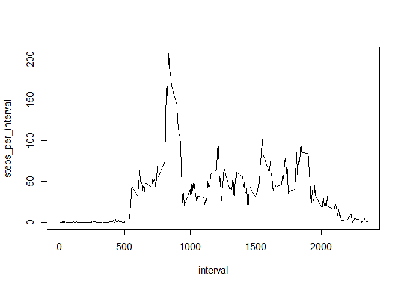

## Loading and preprocessing the data


```r
#loading tidyverse library
library(tidyverse)
```

```
## Warning: package 'tidyverse' was built under R version 3.5.3
```

```
## -- Attaching packages ---------------------------------------------- tidyverse 1.2.1 --
```

```
## v ggplot2 3.2.1     v purrr   0.3.2
## v tibble  2.1.3     v dplyr   0.8.3
## v tidyr   1.0.2     v stringr 1.4.0
## v readr   1.3.1     v forcats 0.4.0
```

```
## Warning: package 'ggplot2' was built under R version 3.5.3
```

```
## Warning: package 'tibble' was built under R version 3.5.3
```

```
## Warning: package 'tidyr' was built under R version 3.5.3
```

```
## Warning: package 'readr' was built under R version 3.5.3
```

```
## Warning: package 'purrr' was built under R version 3.5.3
```

```
## Warning: package 'dplyr' was built under R version 3.5.3
```

```
## Warning: package 'stringr' was built under R version 3.5.3
```

```
## Warning: package 'forcats' was built under R version 3.5.3
```

```
## -- Conflicts ------------------------------------------------- tidyverse_conflicts() --
## x dplyr::filter() masks stats::filter()
## x dplyr::lag()    masks stats::lag()
```

```r
#Loading Data
activity_data <- read.table(unz("activity.zip","activity.csv"), header=TRUE, sep=",")
```


## What is mean total number of steps taken per day?

Calculating total number of steps each day

```r
steps_per_day_data <- activity_data %>% group_by(date) %>% summarise(steps_per_day=sum(steps))
```

Plotting Histogram of steps per day 

```r
hist(steps_per_day_data$steps_per_day)
```

<!-- -->

Calculating  mean and median of steps per day

```r
mean_steps_per_day <- mean(steps_per_day_data$steps_per_day, na.rm=TRUE)
mean_steps_per_day
```

```
## [1] 10766.19
```

```r
median_steps_per_day <- median(steps_per_day_data$steps_per_day, na.rm=TRUE)
median_steps_per_day
```

```
## [1] 10765
```

The mean steps per day is 1.0766189\times 10^{4} and  the median steps per day is 10765

## What is the average daily activity pattern?

Calculating average steps per 5-minute interval

```r
steps_per_interval_data <- activity_data %>% group_by(interval) %>% summarise(steps_per_interval=mean(steps,na.rm=TRUE))
```


Plotting steps per interval on a line plot


```r
plot(steps_per_interval~interval, data=steps_per_interval_data, type="l")
```

<!-- -->

Find the max interval

```r
max_interval <- steps_per_interval_data[which.max(steps_per_interval_data$steps_per_interval),]$interval

max_interval
```

```
## [1] 835
```


The 5-minute interval with the maximum average steps per day across the data set is 835.

## Imputing missing values

Calculating total number of missing values in the dataset

```r
count_nas <- sum(is.na(activity_data$steps))
count_nas
```

```
## [1] 2304
```

I'm going to take the average number of steps per interval and plug that in for NAs by merging the steps_per_interval data to the original data set then making a new column that fills in NAs  

Merging Datasets

```r
merged_data <- left_join(activity_data, steps_per_interval_data, by="interval")
```

Making new column that replaces nas with average

```r
merged_data$steps_nona <- case_when(
        is.na(merged_data$steps)==TRUE ~ as.character(merged_data$steps_per_interval), 
        TRUE ~ as.character(merged_data$steps))

merged_data$steps_nona <- as.numeric(merged_data$steps_nona)
```

Make a histogram of the total number of steps each day

```r
steps_perday_nona <- merged_data %>% group_by(date) %>% summarise(steps_nona_perday=sum(steps_nona))

hist(steps_perday_nona$steps_nona_perday)
```

<!-- -->
Calculating new mean and median

```r
new_mean_perday <- mean(steps_perday_nona$steps_nona_perday)
new_mean_perday
```

```
## [1] 10766.19
```

```r
new_median_perday <- median(steps_perday_nona$steps_nona_perday)
new_median_perday
```

```
## [1] 10766.19
```

Calcualting difference

```r
mean_difference <- ((new_mean_perday/mean_steps_per_day)-1)*100
mean_difference
```

```
## [1] 0
```

```r
median_difference <- ((new_median_perday/median_steps_per_day)-1)*100
median_difference
```

```
## [1] 0.01104207
```
The mean after imputing na's is 1.0766189\times 10^{4} and the median after imputing na's is 1.0766189\times 10^{4}. This is a difference of 0% and 0.0110421% respectively


## Are there differences in activity patterns between weekdays and weekends?
Creating new variable for weekdays vs weekend

```r
merged_data_weekdays<- merged_data %>% mutate(weekday=weekdays(as.Date(date)))

merged_data_weekdays$weekend <-    
        as.factor(case_when(merged_data_weekdays$weekday=="Saturday" |  
                                    merged_data_weekdays$weekday=="Sunday" ~ 
                                    "weekend",TRUE~"weekday"))
```

Calculate avg steps per interval weekend vs weekday

```r
steps_perinterval_weekend <- merged_data_weekdays %>% group_by(weekend,interval) %>% summarise(avg_steps_interval = mean(steps_nona))
```

Create Plot

```r
library(ggplot2)
steps_perinterval_weekend %>% ggplot(aes(interval,avg_steps_interval)) + geom_line() + facet_grid(weekend~.)
```

<!-- -->

